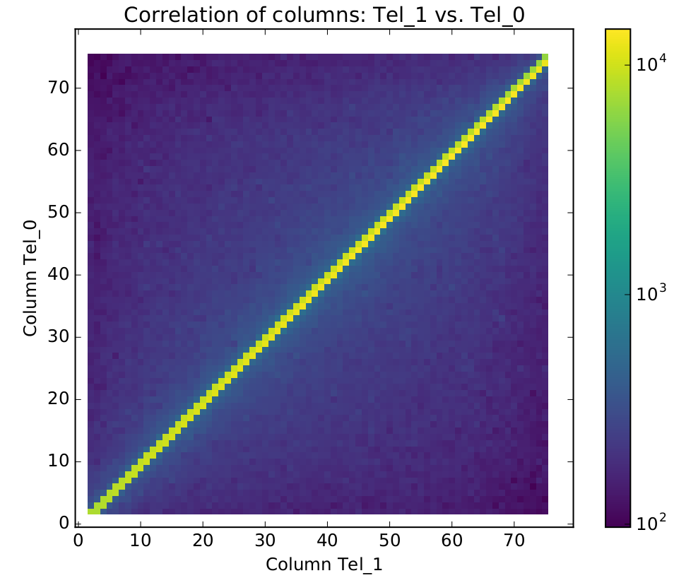
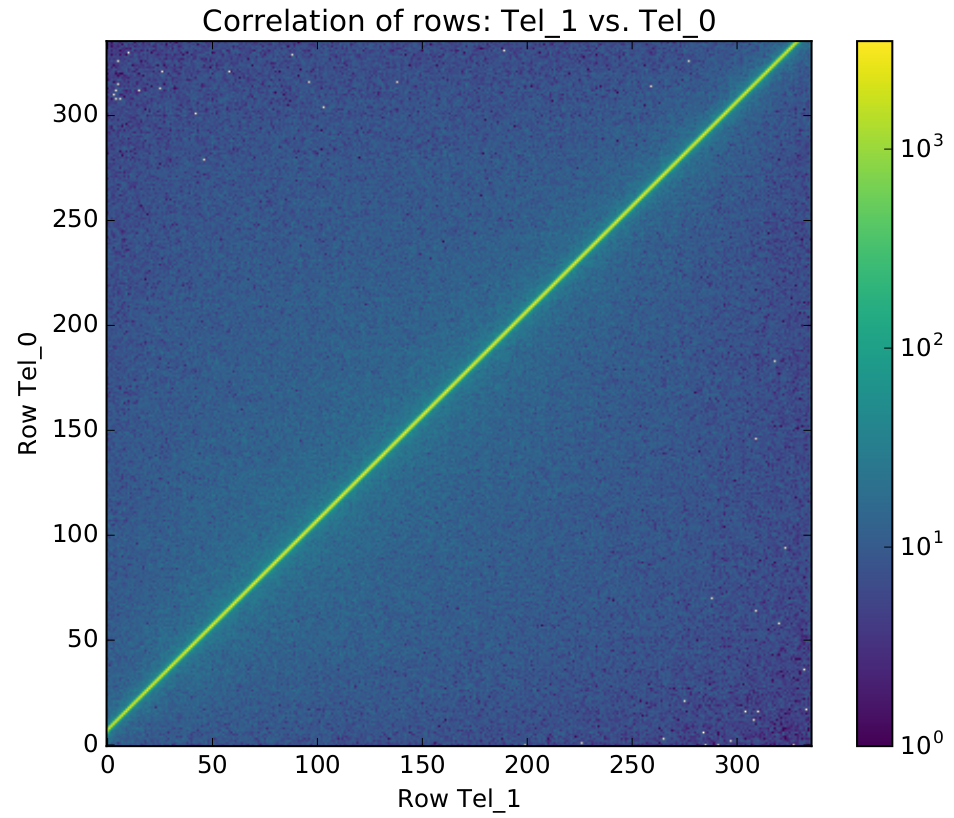
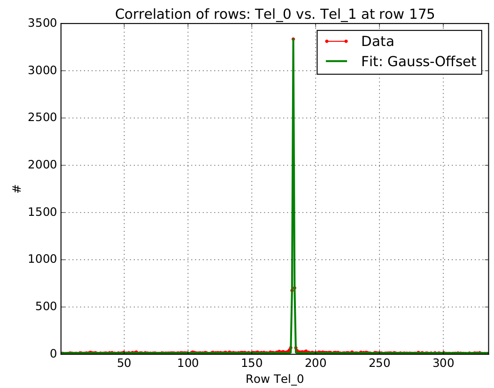
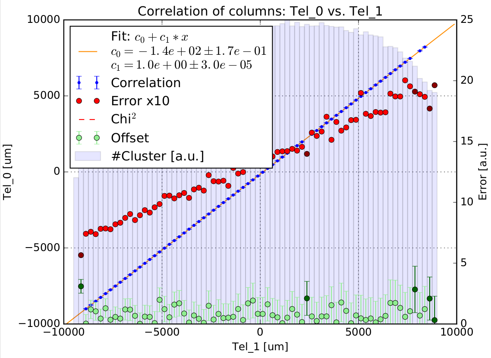
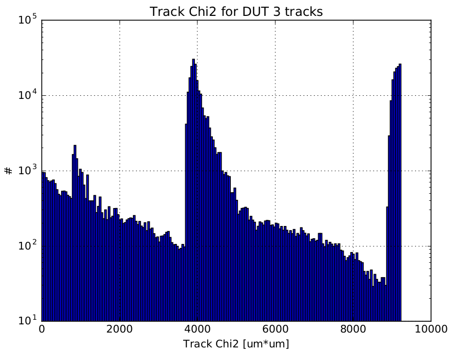
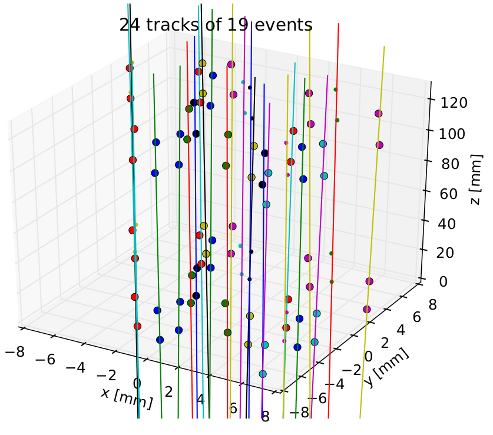
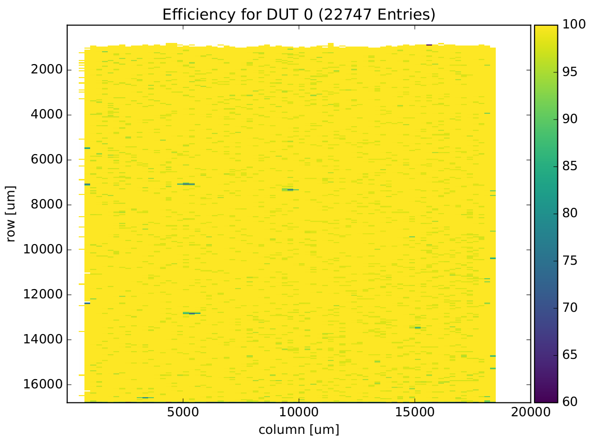

.. toctree::
   :numbered:

Examples
********

There are several examples available that cover different setups.
These examples are a good starting point to get to know `Testbeam Analysis`.

ATLAS FE-I4 telescope
=====================
.. automodule:: beam_telescope_analysis.examples.fei4_telescope

The created plots after the consecutive analysis steps are shown here:

Original correlation :download:`pdf output <_static/example_fei4/Correlation.pdf>`

Original pre-alignment :download:`pdf output <_static/example_fei4/Prealignment.pdf>`

Original track fitting :download:`pdf output <_static/example_fei4/Correlation.pdf>`

Original event plot :download:`pdf output <_static/example_fei4/Event.pdf>`

Original efficiency :download:`pdf output <_static/example_fei4/Efficiency.pdf>`

EU telescope
=====================
.. automodule:: beam_telescope_analysis.examples.eutelescope

