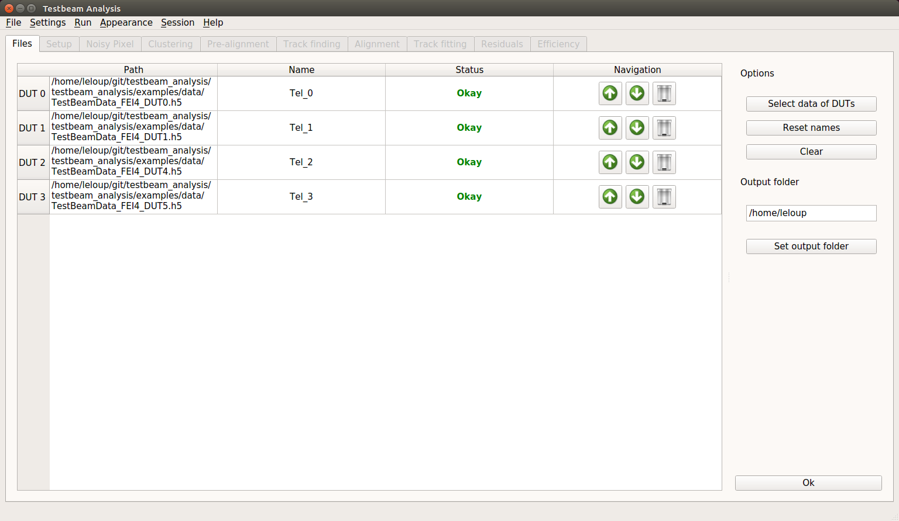
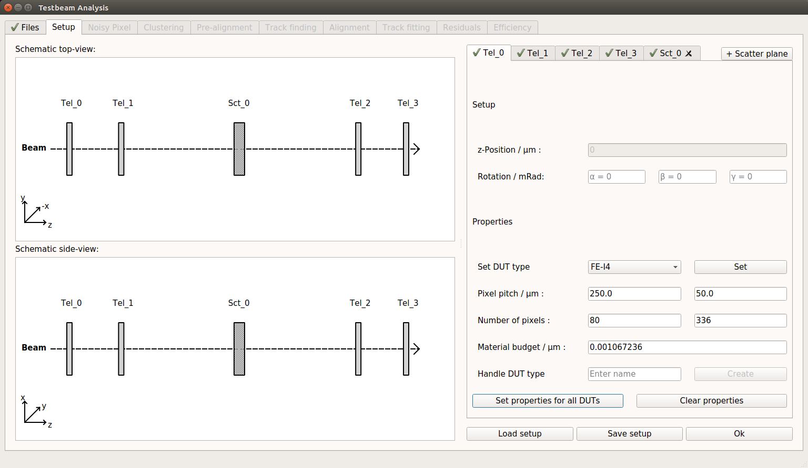
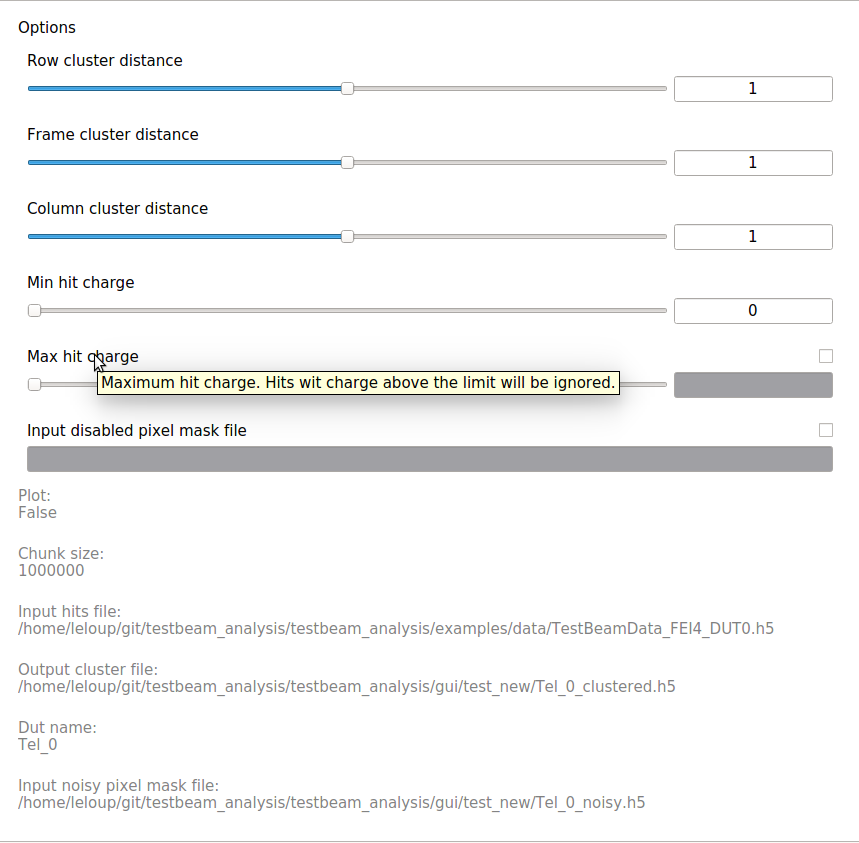
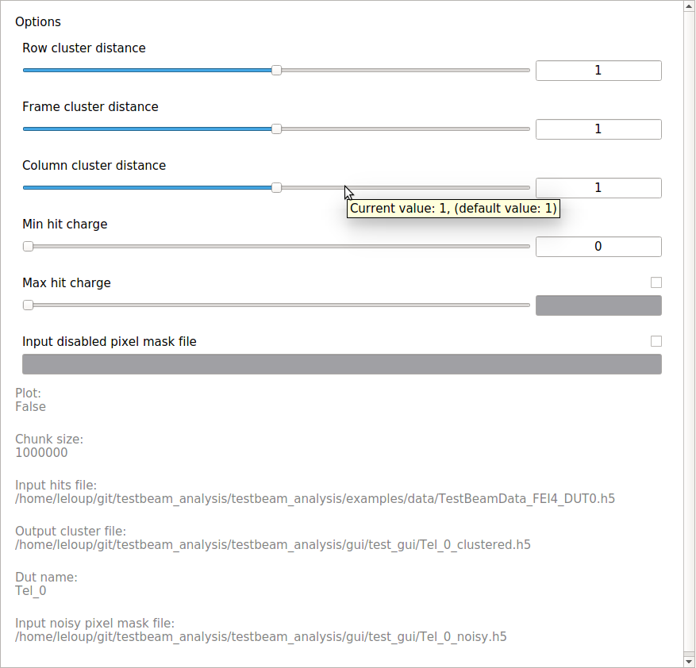

Graphical user interface
========================

The following documentation explains the features and usage of the graphical user interface (GUI) of *testbeam analysis*.
The GUI is written in *PyQt* and intended to simplify the analysis procedure. Its structured into several *tabs*, one for each step of a complete analysis.
The current analysis step generally depends on the preceding, thus the analysis has a consecutive structure.

The graphical user interface offers the following features: 

- Input file consistency check and setup plotting
- Documentation of options via function *introspection*
- Logging from analysis to GUI
- Exception handling
- Plotting results into GUI
- Saving and loading analysis sessions
- Running consecutive analysis without user interaction
- Multi-threading
- Support of `ViTables <https://github.com/uvemas/ViTables>`_

.. NOTE::

   Due to current `dependency issues <https://github.com/conda-forge/vitables-feedstock/issues/3>`_ on *PyQt* version 5, a system installation of ViTables is required, e.g. on Ubuntu run
   
.. code-block:: bash

   sudo apt-get install vitables

After following the instructions given in the installation guide and after running

.. code-block:: bash
      
   python setup.py develop

in the *tesbeam analysis* folder, the GUI can be opened from the shell via
   
.. code-block:: bash

   tba

.. NOTE::

   A minimum screen resolution of 1366 x 768 is required in order to display all features correctly.
   
File selection
**************

The file selection tab provides a table in order to display and handle the input files of all *devices under test* (*DUT*).
The input files can be selected via a button click or *dragged & dropped* onto the table area on the left-hand side of the file selection tab.
After file selection, the path to each input file, the DUT name for subsequent analysis as well as the file status (each input file is checked for required information)
are displayed in the table. The table entries can be moved or deleted by usinf the buttons in the *Navigation* column.
Each DUT can be optionally renamed by double-clicking on the respective field in the table, the default naming is *Tel_i* where *i* is the DUT index.
The output folder for the following analysis can be selected via the respective button on the right-hand side of the tab.
To proceed the analysis (e.g. press the 'Ok' button), input files must be selected and their status must be *okay*. 
An example of the files selection tab is shown below.

.. NOTE::

   The required input files must be already interpreted hit files in *HDF5* format where each file must contain the following data:

   .. code-block:: bash

      event_number frame charge column row

Example of the file selection for FE-I4 telescope data, consisting of 4 FE-I4 pixel detectors

Setup 
*****

The setup tab provides a plotting area on the left-hand side of the tab in order to plot the schematic test beam setup as well as a tab to input setup information for each DUT on the right-hand side.
The telescope setup is plotted from the top- (upper) and side-view (lower) with rotations shown multiplied by a factor of 10 and correct relative distances in between DUTs.
Information for each DUT can be input manually or selected from a list with predefined DUT-types. This list can be extended by the current, complete information via entering a *new* name into
the respective field and pressing the respective button. DUT-types can be overwritten or removed from the list by typing `name` or `:name` respectively, into the respective field and pressing
the button. Dead material (*scatter planes*) in the setup can be added by clicking the button in the upper-right corner. 
To proceed the analyis (e.g. press the 'Ok' button), all required information regarding the setup of each DUT must be filled in.
A complete setup can be saved from and loaded into the setup tab by using the respective buttons on the bottom right-hand side. 
An example of the setup tab is shown below.

Example of setup tab for FE-I4 telescope data, consisting of 4 FE-I4 pixel detectors and a scatter plane

Analysis
********

The analysis tabs each represent a complete step of the underlying *testbeam analysis* and contain input options of one or more functions.
In general, they consist of a plotting area on the left-hand side of the tab and an input area for the options of the respective analysis functions on the right-hand side.
The plotting area contains the result plots of the analysis step. Result plots can be grouped into several tabs for analysis steps with multiple functions.

The option input area contains three different types of options:

- :needed: Options that must be set. The default value of the option is pre-set.

- :optional: Options that can be set but are not required. The default value is `None`. To effectively set the option, the corresponding `check box` has to be checked.

- :fixed: Options that must not be changed. They are displayed as text at the bottom of the option area.

All options are documented and their widgets created via `introspection <http://book.pythontips.com/en/latest/object_introspection.html#inspect-module>`_ of the corresponding function.
The documentation is shown as a *tooltip* when hovering over the respective option name. Furthermore, the current value of the option is shown as a *tooltip*
when hovering over the input widget.

Option area with needed, optional and fixed options. The documentation and currentvalue are shown as a *tooltip*. Optionals have corresponding *check boxes* to set their values.
 
There are two different analysis tab versions for:

- analysis steps which are applied to :each input file: individually (e.g. *Noisy pixel removal*):
      
   .. image:: _static/gui/noisy.png

Each DUT is represented by a sub-tab in order to individually select input options and display result plots of the underlying analysis functions  
      
- analyis steps which are applied to :output files: of previous analysis steps (e.g. *Prealignment*):
      
   .. image:: _static/gui/prealignment.png

Single tab with input options and result plots for all underlying analysis functions 

The analysis is started by clicking the "Ok" button on the bottom of the tab. A progressbar shows the current progress in percent or current task (e.g. "Analysis" or "Plotting").
A logging console provides information obtained from the underlying analysis function. The logging console can be shown/hidden via `CTRL+L` or in the `Appearance` menu.  
After completion of the analysis, the tab is marked as "completed" via . Each completed analysis can be re-run by clicking the corresponding button on the bottom of the tab.
Re-running a tab requires to reset all subsequent analysis tabs. A complete, consecutive analysis with default values can be run by `CTRL+R` or in the `Run` menu.

.. image:: _static/gui/noisy_logger.png

Logging console on Noisy Pixel tab

Exception handling
******************

Exceptions which are thrown by an analysis or plotting function are handled via a separate window. The window shows the type of exceptions and allows the user to switch between the exception message
and the full traceback which also can be saved. Upon an analysis exception, the user may decide whether to reset the current tabs input to default or keep the input configuration in order to only change a single/few 
input options by clicking the respective buttons. An example of the exception window can be seen below.

.. image: _static/gui/exception_1.png
   :width: 45%

.. image: _static/gui/exception_2.png
   :width: 45%

Exception window with error message (left) and full traceback (right).

Saving/Loading sessions
***********************

The current analysis progress can be saved via `CTRL+S` and a previously saved analysis session can be loaded via `CTRL+O` or in the `Session` menu.
Loading a session restores all tabs with their complete information from the respective session.

.. NOTE::
   
   Sessions are saved in a `yaml` file in a `sessions/` folder in the current output folder. In order to load a session,
   the output files of that session need to be *either* in the same folder as the session `yaml` *or* in their original output folder.
   Sessions can only be saved after the setup is completed and in between analysis steps.

